<!-- Generated by GitHub Profile Agent Console. Edit profile.config.json, then run npm run generate. -->

  <picture>
    <source media="(max-width: 760px) and (prefers-color-scheme: dark)" srcset="./assets/hero/agent-console-4c3bcc30-mobile-dark.svg">
    <source media="(max-width: 760px)" srcset="./assets/hero/agent-console-4c3bcc30-mobile-light.svg">
    <source media="(prefers-color-scheme: dark)" srcset="./assets/hero/agent-console-4c3bcc30-dark.svg">
    <source media="(prefers-color-scheme: light)" srcset="./assets/hero/agent-console-4c3bcc30-light.svg">
    
  </picture>

  
  

## About Me

IT student focused on building real, working systems - from RAG chatbots to automation pipelines, not just coursework.

Prior experience in React, PHP/Laravel, and AI automation tooling through freelance and internship work.

## Current Focus

| Area | What I am exploring |
| --- | --- |
| **AI Automation** | Designing RAG pipelines and automation workflows using tools like Langflow and n8n. |
| **Web Development** | Building with React, PHP/Laravel, and modern JS tooling. |
| **Chatbot Development** | Building retrieval-augmented chatbots with anti-fabrication safeguards and multi-turn memory. |

## Featured Work

| Project | Focus | Why it matters |
| --- | --- | --- |
| [**Onboarding Buddy**](https://github.com/unkpell0/onboarding-buddy-live) | RAG-based HR onboarding chatbot | A two-stage RAG chatbot that answers new-hire questions from HR policy documents, with anti-fabrication safeguards and multi-turn memory. [Live](https://onboarding-buddy-live.vercel.app/) |

## Research Direction

Learning by shipping - every project is built to be demoable, not just gradeable.

## Tech Stack

`React` · `PHP` · `Laravel` · `Langflow` · `n8n` · `JavaScript`

## Recent Activity

<!-- AUTO:ACTIVITY:START -->
- Aug 29, 2026: pushed 1 commit to [unkpell0/Digilib](https://github.com/unkpell0/Digilib).
- Aug 28, 2026: pushed 1 commit to [unkpell0/Digilib](https://github.com/unkpell0/Digilib).
- Aug 27, 2026: pushed 1 commit to [unkpell0/Digilib](https://github.com/unkpell0/Digilib).
- Aug 26, 2026: pushed 1 commit to [unkpell0/Digilib](https://github.com/unkpell0/Digilib).
- Aug 25, 2026: pushed 1 commit to [unkpell0/unkpell0](https://github.com/unkpell0/unkpell0).
- Aug 25, 2026: created a branch in [unkpell0/unkpell0](https://github.com/unkpell0/unkpell0).
<!-- AUTO:ACTIVITY:END -->

---

  Learning by shipping — every project is built to be demoable, not just gradeable.

